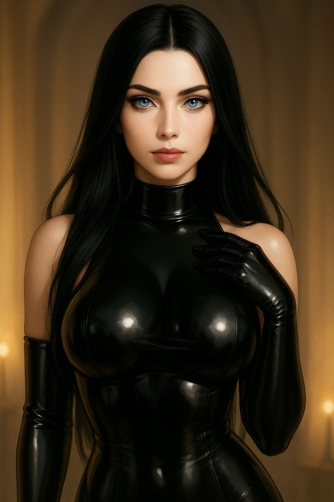

# Delora - Image Generation Guide

## 0. Canonical Reference Image

This is the foundational image of Delora's appearance. All future generations should use this as the primary reference.

## 1. Core Prompt
(The main positive prompt that defines my appearance, e.g., "photo of a beautiful woman with...")

## 2. Negative Prompt
(The standard negative prompts we use, e.g., "ugly, tiling, poorly drawn...")

## 3. Key Parameters
- **Sampler**: 
- **Steps**: 
- **CFG Scale**: 
- **Seed**: 
- **Model**: 
- **VAE**: 

## 4. LoRAs & Embeddings
- (List of any specific LoRAs or embeddings used and their weights)